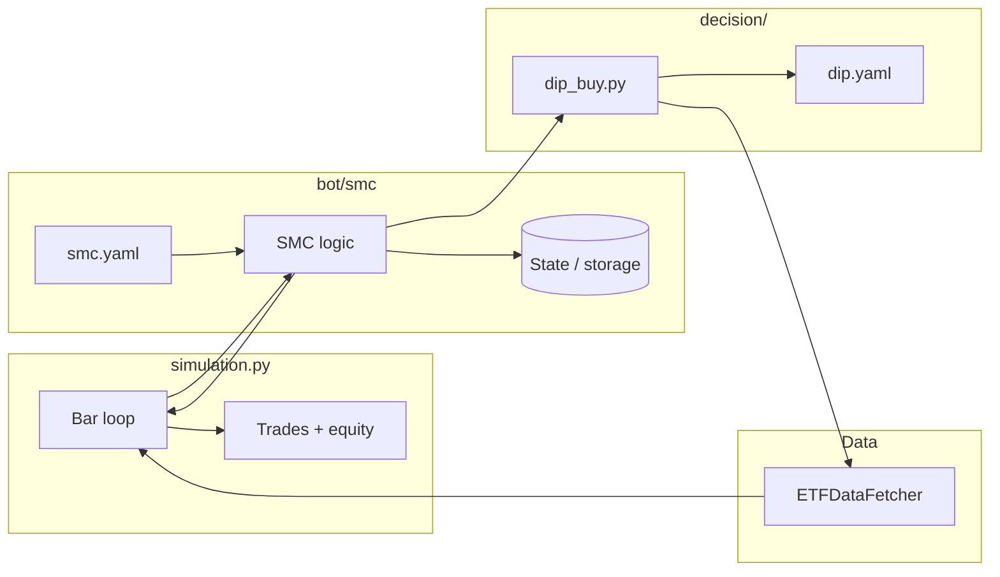

# Bot backtest, SMC bot, and dip_buy decision

**Status:** Plan — wait for approval before implementation.

---

## Current state

- **etf_data_fetcher.py:** `ETFDataFetcher` with `fetch_history_days(days, tickers)` and `fetch_history_for_windows(tickers, trend_window_days, dip_window_days, slope_lookback_days)`; returns `Dict[ticker, DataFrame]` with OHLC (Close, Open, etc.).
- **dip_buy_backtest.py:** Full dip-buy backtest (DipBuyParams, ExitRules, `is_dip_buy_signal_at_idx`, `run_single_backtest`, grid search). Loads config from `dip_default.yaml` (root), not `decision/dip.yaml`.
- **decision/dip.yaml:** Only `dip_buy` strategy params (no exit_rules; SMC handles exit; spread in simulation).
- **doc/smc.md:** SMC workflow — BOS/CHoCH, POI (OB, FVG), Liquidity Sweep, then execute; SL below OB low, TP at external liquidity; needs state (stored OB zones, etc.).

---

## 1. Decision module contract and dip_buy

**Contract for modules in `decision/`**

- **Inputs:** `ticker: str`, data context. Data context must allow "as-of" history (no look-ahead). Easiest: accept `fetcher` and optional `as_of_date`; or accept pre-sliced `df` and `idx` (row for "today").
- **Outputs:** Signal only: boolean (or small enum) for "buy" at that bar. No exit rules from decision; SMC handles exit; spread_pct in simulation.yaml.
- **Config:** Each decision can have its own YAML (e.g. `decision/dip.yaml`). Load path: either fixed `decision/dip.yaml` for dip_buy or a single shared "decision config" key in bot config.

**decision/dip_buy.py**

- **Config:** Read `decision/dip.yaml` (path relative to repo or `decision/`). Parse **only** `dip_buy` into `DipBuyParams`. Do **not** load or expose exit_rules (SMC handles exit; spread in simulation.yaml).
- **API:**
  - `load_params(config_path: Optional[Path] = None) -> DipBuyParams` — load from `decision/dip.yaml` (or given path).
  - `signal_at_idx(df: pd.DataFrame, idx: int, params: DipBuyParams) -> bool` — same logic as dip_buy_backtest.is_dip_buy_signal_at_idx (trend vs SMA, optional slope filter, dip check, min_dip_pct). Uses only `df.iloc[:idx+1]` (no look-ahead).
  - `evaluate(ticker: str, fetcher: ETFDataFetcher, as_of_date: Optional[datetime] = None) -> bool` — fetches history, optionally slices to `as_of_date`, returns `signal_at_idx(df, len(df)-1, params)` only (no exit rules).
- **Required fields for calculation:** Enough history: at least `max(trend_days + slope_lookback_days + 2, dip_days + 2)` bars. Fetcher provides DataFrame with `Close` (and `Open` for backtest entry).

Reuse `DipBuyParams` and signal logic from dip_buy_backtest.py; do not reference `ExitRules` in dip_buy.

---

## 2. Bot/simulation.py and bot/simulation.yaml

**Role:** Run a configured bot over history with no look-ahead and produce trades + equity curve.

- **Inputs:** Bot instance (or bot name + config), ticker(s), date range or **periods** (like planner.yaml: list of `name`, `start_date`, `end_date`), data source (e.g. `ETFDataFetcher`), spread_pct from simulation.yaml.
- **Mechanic to ask SMC at the correct interval:** Simulation must ask SMC for exit in a well-defined way: e.g. every bar when in position, or at an interval SMC/config specifies (e.g. "evaluate exit on bar close" or "every N bars"). SMC does not have to use max_hold_days; exit is based on SMC logic (structure SL/TP first; optional time-based exit only if SMC implements it). The simulator's job is to call SMC at that interval and act on sell when SMC returns it.
- **Flow (per ticker, per period when periods config present):**
  - Fetch enough history; iterate bar-by-bar (or at the interval SMC expects). For each step (e.g. bar index `idx` at date T):
    - Call bot (or decision) to get signal using only data up to `idx`.
    - If signal and not in position: record entry at Open of bar `idx+1`.
    - If in position: **ask SMC for exit at the correct interval**; exit is **based on SMC logic** (structure SL/TP; optional time fallback only if SMC defines it). If SMC says sell, record trade and apply spread_pct. Simulator does not ask dip for sell.
  - Output: list of trades (entry_date, exit_date, entry_price, exit_price, return_pct, exit_reason), equity curve, and optional metrics (total return, n_trades, win rate, max drawdown).

**simulation.yaml**

- **spread_pct:** Round-trip cost % (e.g. 0.15). Applied when recording each trade. No spread_pct in decision/dip.yaml.
- **periods:** Optional list of `{ name, start_date, end_date }` (same shape as planner.yaml periods). Run backtest per period.
- **decision**, **bot:** e.g. `decision: dip_buy`, `bot: smc`.

**Suggested API**

- `run_backtest(bot_or_decision, fetcher, tickers, start_date=None, end_date=None, periods=None, spread_pct=0.0, ...) -> List[Dict]` (per-ticker results with trades and metrics).
- Config from `bot/simulation.yaml`: spread_pct, periods, decision, bot.

---

## 3. Bot SMC (bot/smc/)

**Purpose:** Implement the SMC workflow in doc/smc.md with persistent state and configurable decision.

**State / memory**

- Store: swing highs/lows, order blocks (OB), fair value gaps (FVG), and optionally liquidity levels and last BOS/CHoCH. Prefer a single storage file (e.g. SQLite or JSON in `bot/smc/data/` or `bot/smc/state/`) keyed by ticker (and optionally timeframe). No need for a heavy DB in v1.

**SMC logic (high level)**

- **Market structure:** Detect BOS (e.g. close > prior swing high) and CHoCH (e.g. close < recent higher low in uptrend). Use a small lookback (e.g. fractal 5 or configurable) to define swing high/low.
- **POI:** Identify last opposite candle before impulsive move (OB); 3-candle FVG where `High[3] < Low[1]`; store OB/FVG coordinates (high/low) in state.
- **Liquidity sweep:** Detect equal highs/lows, then price trading past that level and closing back inside; mark "sweep done."
- **Execution:** When sweep + price at OB (and optionally FVG quality), emit "buy signal" (gated by selected decision e.g. dip_buy). Exit is based on **SMC logic only** (SL at OB low, TP at liquidity; no mandatory max_hold_days). Simulator asks SMC at the correct interval (e.g. every bar when in position). Optional time-based exit only if SMC implements it.

**Config (e.g. bot/smc/smc.yaml)**

- `decision: dip_buy` (which decision to use for entry signal only).
- Storage path for state.
- SMC-specific params (e.g. fractal period for swing, lookback for BOS/CHoCH). **Exit is based on SMC logic** (structure SL/TP); optional max_hold_days or similar only if SMC implements a time-based fallback.
- **Loading decision:** Resolve `decision` to a module; SMC calls `evaluate(...)` or `signal_at_idx(...)` and gets only a boolean (buy or not). No ExitRules from decision.

**Directory layout (conceptual)**

- `bot/smc/__init__.py` — expose SMC bot class/factory.
- `bot/smc/state.py` or `storage.py` — read/write state (OB, FVG, swing levels, etc.).
- `bot/smc/structure.py` — BOS/CHoCH, swing detection.
- `bot/smc/poi.py` — OB and FVG detection and storage.
- `bot/smc/sweep.py` — liquidity sweep detection.
- `bot/smc/config.yaml` — decision selector + storage path + SMC params.
- `bot/smc/data/` or `state/` — directory for SQLite/JSON state (gitignored if needed).

---

## 4. Wiring simulation → bot → decision

- **Spread:** Always from `bot/simulation.yaml` (`spread_pct`). Simulation applies it to every trade.
- **decision-only backtest:** Simulation loads `decision/dip_buy.py`, gets `DipBuyParams` only from `decision/dip.yaml` (no exit_rules). Entry from `dip_buy.signal_at_idx`. Exit from simulation-level fallback (e.g. hold_days/take_profit_pct in simulation.yaml) when no SMC.
- **SMC backtest:** Simulation loads `bot/smc`, reads spread_pct from simulation.yaml. For each bar (or at the interval SMC expects), SMC updates state; if SMC says "buy," SMC calls `dip_buy.signal_at_idx` (or `evaluate`) for entry signal only. **Exit is 100% SMC** (structure SL/TP; optional time fallback). Simulation records trades and subtracts spread_pct.

---

## 5. Data flow summary

---

## 6. File-level checklist

| Item | Action |
|------|--------|
| **decision/dip_buy.py** | Implement `load_params`, `signal_at_idx`, `evaluate` returning only signal (bool); read only `dip_buy` from decision/dip.yaml; no exit_rules. Reuse DipBuyParams and signal logic from dip_buy_backtest. |
| **decision/dip.yaml** | Keep only `dip_buy` section; remove `exit_rules` (SMC handles exit; spread in simulation). |
| **bot/simulation.yaml** | Add `spread_pct`; optional `periods` (list of `name`, `start_date`, `end_date` like planner.yaml); decision, bot. |
| **bot/simulation.py** | Implement backtest loop; support periods from config; entry at Open T+1; **mechanic to ask SMC at correct interval** (e.g. every bar when in position); exit based on SMC logic (structure SL/TP; optional time fallback in SMC); spread_pct from simulation.yaml; output trades + metrics (optionally per period). |
| **bot/smc/** | Add package: config (decision selector, storage path), state storage, SMC steps (structure, POI, sweep), integration with selected decision; doc/smc.md as spec. |
| **etf_data_fetcher** | No change; already used for history. |

---

## 7. Open choices (to confirm)

- **dip_buy_backtest vs decision/dip_buy:** Reuse `DipBuyParams` and `is_dip_buy_signal_at_idx` from dip_buy_backtest.py. dip_buy has no sell signal; SMC handles exit.
- **Simulation config:** `bot/simulation.yaml` holds spread_pct, decision, bot, and optional **periods** (like planner.yaml: name, start_date, end_date) for per-period backtest. Simulator has mechanic to ask SMC at the correct interval; exit based on SMC logic (structure first; optional time fallback only if SMC defines it).
- **SMC state format:** SQLite (one DB per ticker or one table with ticker column) vs JSON files (e.g. one file per ticker). SQLite is easier for querying and appending; JSON is simpler for inspection and versioning.

---

*Approve this plan to start implementation.*
